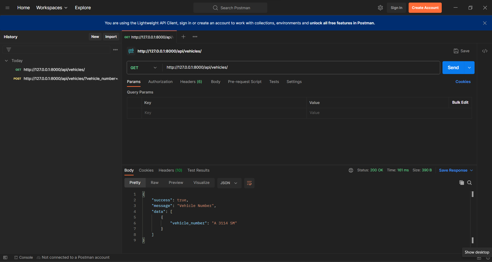
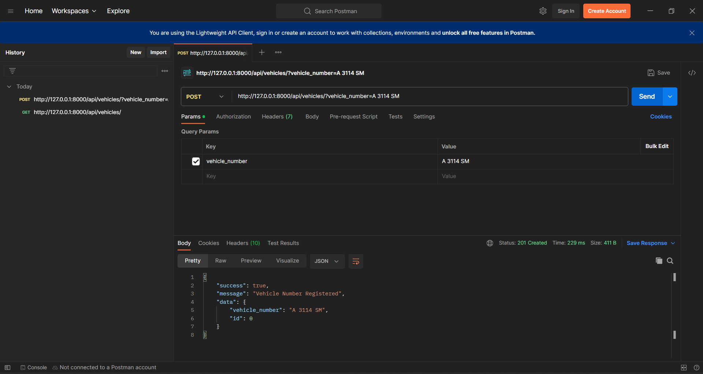
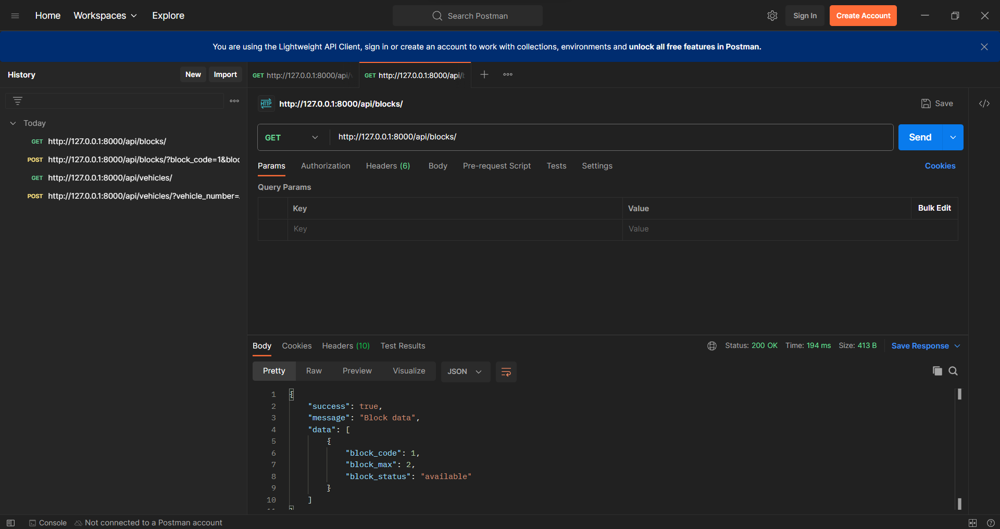
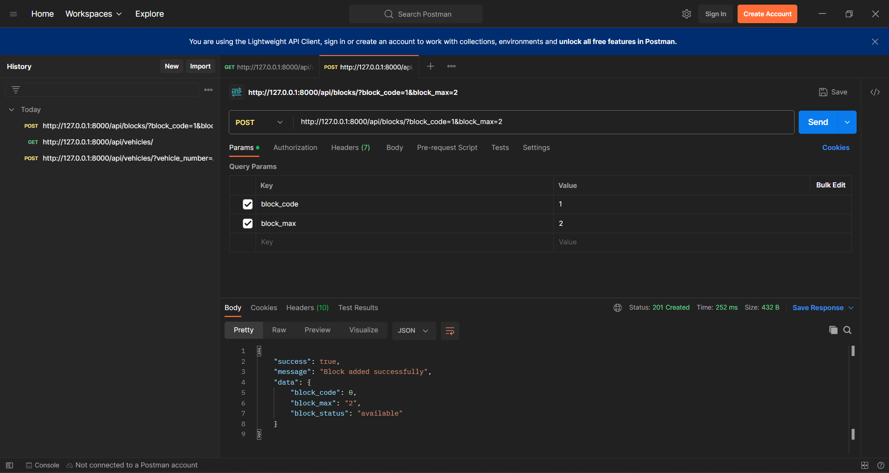
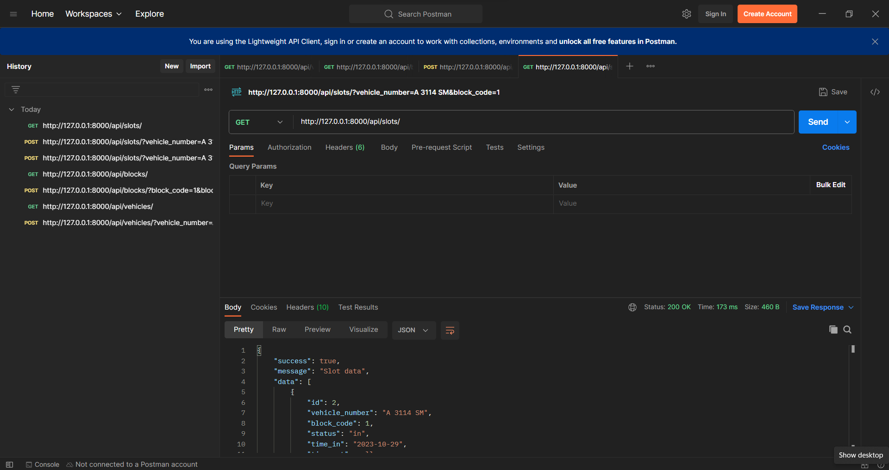
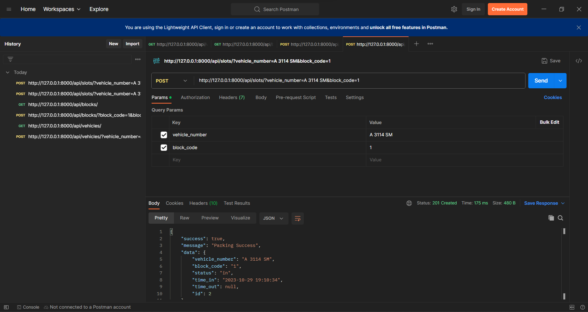
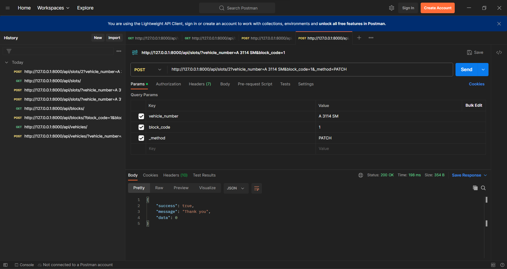

# Bestada
Bestada Test Nomer 2 (API)

## Dokumentasi API
1.  Vehicle
  - Get Vehicle
  > Get Vehicle Number digunakan untuk mengambil data nomer kendaraan di database.
    - Method : `GET`
    - Endpoint : `/api/vehicles`

  - Create Vehicle Number
  > Create Vehicle Number digunakan untuk menambahkan nomer kendaraan ke database.
    - Method : `POST`
    - Endpoint : `/api/vehicles`
    |Key|Type|Value|
    | ------ | ------ | ------ |
    |vehicle_number|string|Masukan nomer kendaraan|

2.  Block
  - Get Block data
  > Get Block data digunakan untuk mengambil data blok di database.
    - Method : `GET`
    - Endpoint : `/api/blocks`

  - Create Block data
  > Create Block data digunakan untuk menambahkan blok data ke database.
    - Method : `POST`
    - Endpoint : `/api/blocks`
    |Key|Type|Value|
    | ------ | ------ | ------ |
    |block_code|interger|Masukan kode blok|
    |block_max |interger|Masukan maksimal parkir yang ada di blok|

3.  Slot
  - Get Slot data
  > Get Slot data digunakan untuk mengambil data slot pengguna parkiran di database.
    - Method : `GET`
    - Endpoint : `/api/slots`

  - Create Slot data
  > Create Slot data digunakan untuk menambahkan data pengguna parkiran ke database.
    - Method : `POST`
    - Endpoint : `/api/slots`
    |Key|Type|Value|
    | ------ | ------ | ------ |
    |vehicle_number|string|Masukan nomer kendaraan|
    |block_code |interger|Masukan kode blok|

    > Update Slot data digunakan untuk mengubah data pengguna yang keluar dari parkiran.
    - Method : `POST`
    - Endpoint : `/api/slots/:id`
    |Key|Type|Value|
    | ------ | ------ | ------ |
    |vehicle_number|string|Masukan nomer kendaraan|
    |block_code |interger|Masukan kode blok|
    |_method |text|PATCH|

